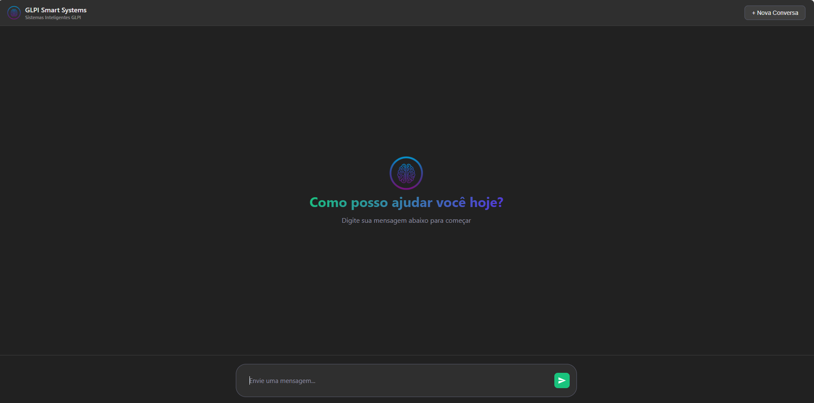
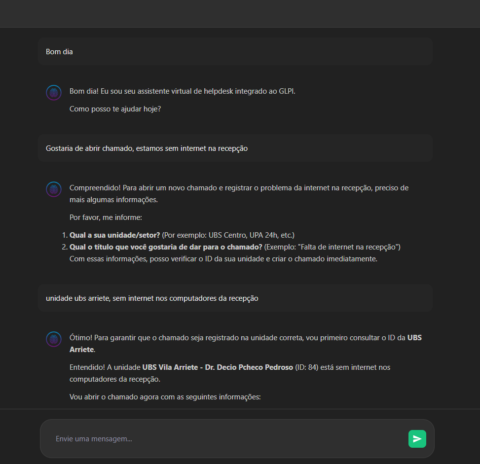
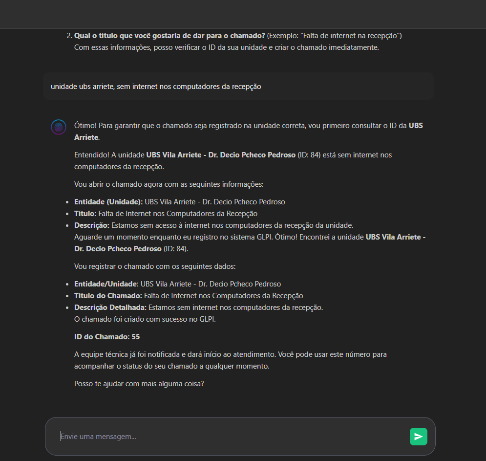
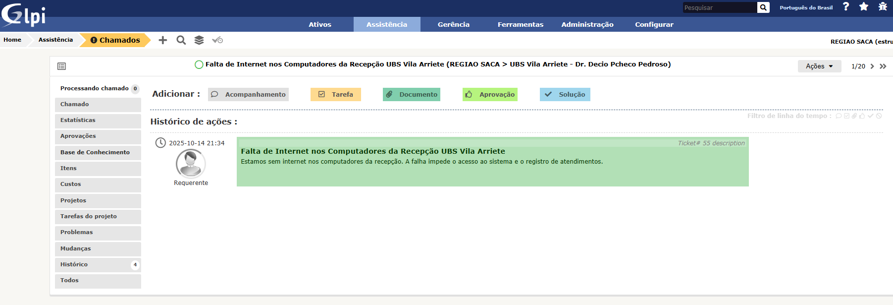

# GLPI AI Agente

  
  
  

Implementando arquitetura limpa no projeto com inteligência artificial Gemini AI, utilizando sua API gratuita para tomada de decisão em atendimento de helpdesk com a ferramenta GLPI. O sistema executará criação de chamados, listagem de chamados, listagem de entidades, entre outras funcionalidades, conforme o atendimento ao usuário. A IA realizará decisões inteligentes para proporcionar a melhor experiência ao usuário.