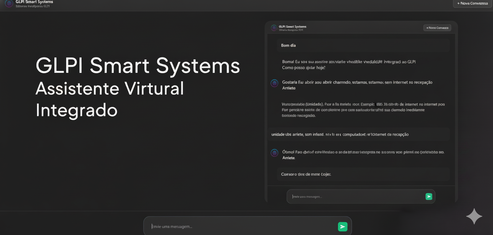

# GLPI AI Agente

<!-- Implementando arquitetura limpa no projeto com inteligência artificial Gemini AI, utilizando sua API gratuita para tomada de decisão em atendimento de helpdesk com a ferramenta GLPI. O sistema executará criação de chamados, listagem de chamados, listagem de entidades, entre outras funcionalidades, conforme o atendimento ao usuário. A IA realizará decisões inteligentes para proporcionar a melhor experiência ao usuário. -->

## 📋 Visão Geral

Este projeto implementa uma solução inovadora de atendimento de helpdesk que integra princípios de **Arquitetura Limpa** com a inteligência artificial **Gemini AI**, utilizando sua API gratuita para automação e otimização do processo de tomada de decisão. O sistema se conecta à ferramenta **GLPI** (Gestão Livre de Parque Informático), proporcionando uma experiência inteligente e eficiente tanto para usuários quanto para equipes de suporte.

## 🎯 Objetivos Principais

- Implementar uma arquitetura limpa, escalável e manutenível
- Integrar inteligência artificial para análise inteligente de demandas de suporte
- Automatizar processos de criação, categorização e priorização de chamados
- Melhorar significativamente a experiência do usuário através de decisões inteligentes
- Utilizar a API gratuita do Gemini AI para redução de custos operacionais

## ✨ Funcionalidades Principais

### 📝 Gestão de Chamados
- **Criação automática de chamados** com classificação inteligente via IA
- **Listagem e consulta** de chamados com filtros avançados
- **Priorização automática** baseada em análise de contexto e histórico
- **Roteamento inteligente** para o departamento ou técnico mais apropriado

### 🏢 Gestão de Entidades
- **Listagem de entidades** cadastradas no sistema GLPI
- **Associação inteligente** entre usuários, categorias e recursos
- **Visualização de estrutura organizacional** e dependências

### 🤖 Inteligência Artificial
- **Análise contextual** de problemas descritos pelos usuários
- **Sugestão de soluções** baseadas em histórico e conhecimento acumulado
- **Detecção de padrões** para identificação de problemas recorrentes
- **Otimização de fluxos** de atendimento através de aprendizado contínuo

### 🔄 Fluxo de Atendimento Inteligente
- Recebimento e análise inicial do chamado
- Classificação automática e sugestão de categoria
- Determinação de prioridade com justificativa
- Alocação recomendada para equipe de suporte
- Acompanhamento e melhoria contínua

